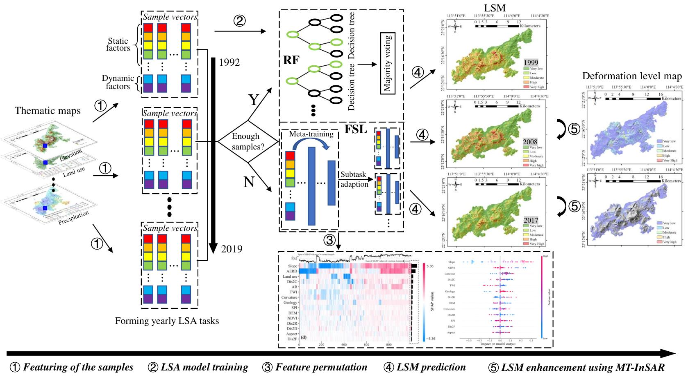

<p align="right">
    <b>  </b> <br> <br>
</p>

# Dynamic Landslide Susceptibility Mapping (tf2).

[//]: # (# Dynamic landslide susceptibility mapping over recent three decades to uncover variations in landslide causes in subtropical urban mountainous areas)

## Table of Contents

- [Background](#background)
- [Data](#data)
- [Dependencies](#dependencies)
- [Contact](#contact)
- [Citation](#citation)


## Background
Landslide susceptibility assessment (LSA) are of paramount importance in mitigating landslide risks. Recently, there has been a surge in the utilization of data-driven methods for predicting landslide susceptibility due to the growing availability of aerial and satellite data. Nonetheless, the rapid oscillations within the landslide-inducing environment (LIE), primarily due to significant changes in external triggers such as rainfall, pose difficulties for contemporary data-driven landslide susceptibility assessment (LSA) methodologies to accommodate LIEs over diverse timespans. This study presents dynamic landslide susceptibility mapping that simply employs multiple predictive models for annual LSA. In practice, this will inevitably encounter small sample problems due to the limited number of landslide samples in certain years. Another concern arises owing to the majority of the existing LSA approaches train black-box models to fit distinct datasets, yet often failing in generalization and providing comprehensive explanations concerning the interactions between input features and predictions. Accordingly, we proposed to meta-learn representations with fast adaptation ability using a few number of samples and gradient updates; and apply SHAP for each model interpretation and landslide feature permutation. Additionally, we applied MT-InSAR for LSA result enhancement and validation. The chosen study area is Lantau Island, Hong Kong, where we conducted a comprehensive dynamic LSA spanning from 1992 to 2019. The proposed methods outperform other methods even adopting a fast adaptation strategy. The model interpretation results demonstrate that the primary factors responsible for triggering landslides in Lantau Island are terrain slope and extreme rainfall. The results also indicate that the variation in landslide causes can be primarily attributed to extreme rainfall events resulting from global climate change and the implementation of the Landslip Prevention and Mitigation Programme (LPMitP) by the Hong Kong government.

 

​         Fig. 1: Overflow


## Data

* The landslide inventory can be found [here](https://data.gov.hk/en-data/dataset/hk-cedd-csu-cedd-entli).
* The related thematic information can be found [here](https://geodata.gov.hk/gs).

[//]: # (The source and experiment data will be opened...)


## Dependencies

The default branch uses tf2 environment:
* cudatoolkit 11.2.2
* cudnn 8.1.0.77
* python 3.9.13
* tensorflow 2.10.0

Install required packages
```
python -m pip install -r requirements.txt
```


## Contact

To ask questions or report issues, please open an issue on the [issue tracker](https://github.com/CLi-de/D_LSM/issues).

## Citation

If this repository helps your research, please cite the paper. Here is the BibTeX entry:

```
@article{MA2025114800,
title = {Dynamic landslide susceptibility mapping over last three decades to uncover variations in landslide causation in subtropical urban mountainous areas},
journal = {Remote Sensing of Environment},
volume = {326},
pages = {114800},
year = {2025},
issn = {0034-4257},
doi = {https://doi.org/10.1016/j.rse.2025.114800},
author = {Peifeng Ma and Li Chen and Chang Yu and Qing Zhu and Yulin Ding and Zherong Wu and Hongsheng Li and Changyao Tian and Xuanmei Fan},
}
```

The preprint can be found: [here](https://arxiv.org/abs/2308.11929)

The 'supplementary materials(.docx)' of the preprint can be found in this repo.
